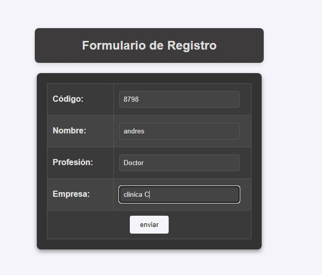
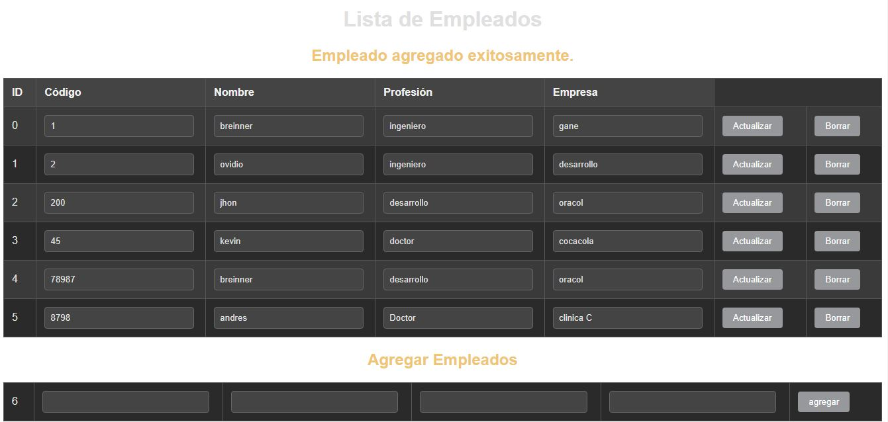
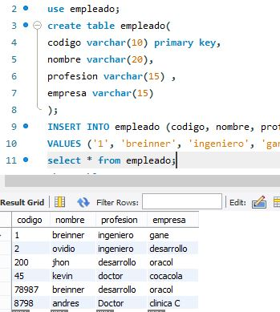

## Proyecto CRUD de Empleados con JPA y Servlets

Este proyecto es una aplicación web que implementa operaciones CRUD (Crear, Leer, Actualizar, Borrar) para la gestión de empleados, utilizando **JPA (Java Persistence API)**
para la persistencia de los datos en una base de datos, y **Servlets** para manejar las solicitudes HTTP.

### Características del proyecto:

- **Agregar Empleados:** Permite añadir empleados ingresando su código, nombre, profesión y empresa.
- **Actualizar Empleados:** Modificación de los datos de un empleado existente.
- **Eliminar Empleados:** Borrar empleados de la base de datos.
- **Visualización de Empleados:** Los empleados se muestran en una tabla con la posibilidad de actualizar o eliminar cada registro.

### Tecnologías utilizadas:

- **Java EE** con servlets para manejar las solicitudes y respuestas HTTP.
- **JPA** para gestionar la persistencia y el acceso a la base de datos.
- **MySQL** (o cualquier base de datos compatible con JPA) como base de datos relacional.
- **HTML/CSS** para la interfaz de usuario.

### Entidad `Empleado`:

La entidad `Empleado` está mapeada a una tabla en la base de datos y contiene los siguientes campos:
- **Código**: El identificador único del empleado (clave primaria).
- **Nombre**: El nombre del empleado.
- **Profesión**: La profesión del empleado.
- **Empresa**: La empresa donde trabaja el empleado.

### Vista de la aplicación:

A continuación se muestra unas capturas de pantalla del index.html,  la página `mostrarDatos.jsp` donde se visualizan los empleados y se puede interactuar con las operaciones CRUD,  tambien una captura de  la entidad en el gestor de base de datos. 

### Cómo usar este proyecto

1. Clona este repositorio en tu máquina local.
2. Configura la conexión con la base de datos en el archivo `persistence.xml`.
3. Despliega la aplicación en un servidor compatible con Java EE, como **GlassFish**.
4. Abre el navegador web y navega a la URL del proyecto.
